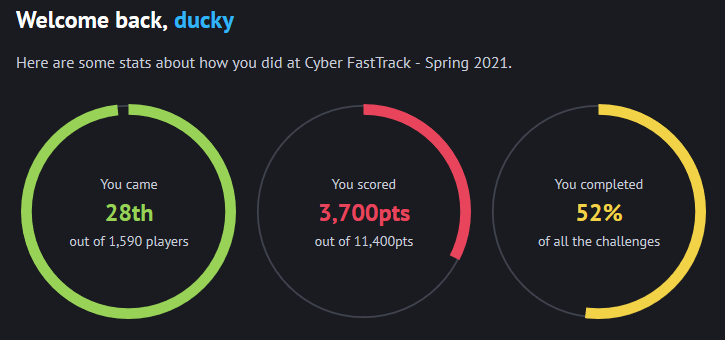

# Cyber FastTrack Spring 2021

Writeups for the [Cyber FastTrack](https://cyber-fasttrack.org/) Spring 2021 Competition where I placed 28th out of 1,590 players.

This was a good experience for me since I am used to competing with my university CTF team, [HuntsvilleTechSupport](https://ctftime.org/team/81423). 

Competing solo is a completely different feeling since I was no longer able to rely on my teammates in my weak areas. Overall, enjoyed the competition and looking forward to see which scholarships I will qualify for!

Feel free to contact me if you want to discuss challenges!
  * Email: wlg0005@uah.edu
  * Discord: Ducky#4488

All challenges are broken up by category within this directory.

Categories:
  * [Binary](./Binary)
  * [Crypto](./Crypto)
  * [Forensics](./Forensics)
  * [Networking](./Networking)
  * [Web](./Web)
 
